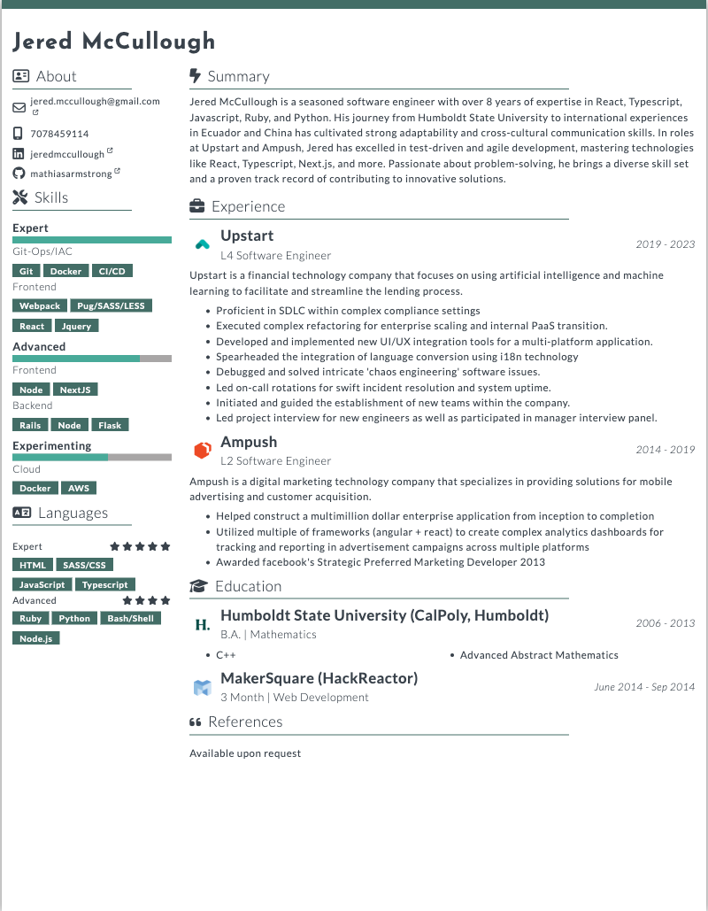

# jsonresume-theme-catalyst

This is the Catalyst theme repository for the [Json Resume](https://jsonresume.org/) project. Unlike the [json-theme-boilerplate](https://github.com/jsonresume/jsonresume-theme-boilerplate) project, this environment has a much improved developer environment to make editing your theme super easy to do.

This was originally forked from [kelyvin/jsonresume-theme-caffeine](https://github.com/kelyvin/jsonresume-theme-caffeine) and I did a few major changes ontop of the base fork.
1. updated to es6 module syntax
2. converted handlebars to pug (roadmap is to convert to react)
3. rebuilt many of hte gulp tasks to use the newer gulp 4 syntax and also fix the live reload and dev enviroment.
4. allow hosting resume assets outside of this repository.
5. removed support for resume-cli and resumed (for now)
6. pruned unused dependencies from package.json



## Status

### Table of Contents

* [Installation](#installation)
* [Features](#features)
* [Getting Started](#getting-started)
* [Theme Overrides](#theme-overrides)
    * [Icons](#icons)
    * [About](#about)
    * [Colors](#colors)
* [Developer Environment](#developer-environment)
* [Creating your resume.json](#creating-your-resumejson)
* [Building the project](#building-the-project)
## Installation
This project uses [gulp](http://gulpjs.com/) for all of its internal build processes.

## Quick Commands
- `yarn dev` 
  - Run the build and generate a resume html page for development, also generates the pdf
- `yarn build` 
  - Exports the resume into a `resume.pdf` file and to an html file
- `yarn clean`
  - clean the output folders 
- `yarn test`

## Printing
  
This resume was painstakingly created to print very nicely.  You can print form either the PDF or the HTML file there are minor differences between the two of these methods.  Furthermore, you might also want to tweak some of the scale features in the 
printing dialog to get the best results. (i.e., 96% scale works well for me.)

## Features
This theme environment comes equipped with the following features to make your development environment easier:

- **Gulp** task management integration, so you can build out your ideal development environment.
- **Sass** and **Pug** support to give you the full capabilties of the system and make it easier for you to build your own custom theme.
- **Auto watch** for file changes and automatically recompile your core assets.
- A modular file system.
- (WIP) Re-integration with [resume-cli](https://github.com/jsonresume/resume-cli) so you can still run the same commands against this project.

## Getting Started

```bash
# install deps
yarn install
# run it with hot reload
yarn dev
```

Running the command above will automatically build your project, load your resume with the theme, listen for changes, and automatically refresh the browser on file changes. A `resume.json` will be created for you by default against the `resume-sample.json` if you do not provide a `resume.json` at the root directory level.

## Creating your resume.json

Please review the [schema here](https://jsonresume.org/schema/) when creating your `resume.json`.

### JSON Resume Extensions

basics.qr_code
basics.og_image
basics.ga_tag
basics.tagline
work[].index

## Building the project
When you run `yarn build` or choose to manually build the project using `gulp`, it will generate a `/public` folder. This folder will be created after running the appropritae gulp tasks against the `/app` folder. Essentially, the app folder is your development environment and the public folder will be what we deploy to production. The public folder is exactly the same as the public folder generated from the jsonresume-theme-boilerplate, thus, our `index.js` will still run against this folder. (this is for re-integration with resumecli)

Alternatively, you can also do a **print page** on the browser and save it as as PDF (by setting margins to none and removing header/footers.)

### Icons
All the icons used in the theme are generated through [Font-Awesome](http://fontawesome.io/). So make sure the `network` key that you specify within your `profiles` json config matches the corresponding font-awesome style name. For example:

```
"profiles": [
  {
    "network": "Twitter",
    ...
  },
  {
    "network": "Facebook",
    ...
  }
```

The Twitter and Facebook network keys will be appended to `fa-` to generate `fa-twitter` and `fa-facebook` respectively. Be sure to search within the [font awesome icons](http://fontawesome.io/icons/) to figure out the correct network name you want to use for the icon (i.e. if you want to use a different facebook icon, change the network name to [Facebook-Official](http://fontawesome.io/icon/facebook-official/) or [Facebook-Square](http://fontawesome.io/icon/facebook-square/)).

### About
The entire about section on the left column is populated through the `basics` json config. This section is intentionally kept narrow to provide a quick summary and prevent it from taking up too much real estate on the resume.

However, unfortunately it may be too narrow for folks with really long emails or website names. You can fix this in one of two ways:

1. You can simply add spaces in your JSON config to indicate line breaks to create multi-line styles. The example below will automatically put the `@piedpiper.com` into its own line

    ```
    "email": "richard.hendriks @piedpiper.com",
    ```


2. If you are only one or two characters away from fitting your long strings, you can adjust the width of the left column by going into `variables.scss` and adjusting the two following variables:

    ```
    $aside-width            : 160px;
    $aside-margin           : 20px;
    ```

    `aside-width` will determine how wide to keep the left column, and `aside-margin` will determine how much space you want to leave between the left column and the main content on the right.

### Colors
I highly recommend this to give your resume its own personal flair, If you want to change the default color used within the theme with your own custom color, change the `$primary-color` variable within `variable.scss` with your own.

```
$primary-color          : $slate-green;
```

## Developer Environment
The most important pieces of this environment are the two `app` and `gulp` folders as well as `resume.ts`. If you've already read through the [jsonresume-theme-boilerplate](https://github.com/jsonresume/jsonresume-theme-boilerplate), you should know what the files within `/app` and `resume.ts` represents.

#### /app
The app folder holds all of your assets. The file system should be straightforward to follow. All views will be under the `/views`  folder. Most unimportant, this folder which contains `resume.hbs`, which is the main Handlebars template that will be used and sent to the theme server to render your resume. The  `/styles` folder contains all of your SASS stylesheets.

#### /gulp
The gulp folder holds all the modularized gulp tasks/configs. Anything gulp related should go here. Please reference `gulpfile.xs` as the source of truth.

#### resume.ts
This is the file that will return the HTML to the theme server and run against the resume-cli. Not much change here from the jsonresume-theme-boilerplate except that it has been modified to accommodate this file system.
